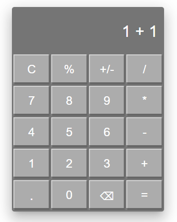

# React Calculator



This is a simple yet functional calculator built using React. The calculator supports basic arithmetic operations such as addition, subtraction, multiplication, and division, along with percentage calculations and sign toggling. It also features keyboard support for convenient use.

## Demo

You can check out the live demo of the calculator [here](https://reculator.vercel.app/).

## Features

-   **Basic Arithmetic Operations**: Perform addition, subtraction, multiplication, and division.
-   **Percentage Calculation**: Quickly convert numbers to percentages.
-   **Sign Toggle**: Easily switch between positive and negative numbers.
-   **Keyboard Support**: Use your keyboard to interact with the calculator, making it faster to perform calculations.
-   **Responsive Design**: Works well on both desktop and mobile devices.

## Getting Started

### Prerequisites

Make sure you have Node.js and npm installed on your machine. You can download them [here](https://nodejs.org/).

### Installation

1. Clone the repository:
    ```sh
    git clone https://github.com/your-username/react-calculator.git
    cd react-calculator
    ```
2. **Install the dependencies**
    ```sh
    npm install
    ```
3. **Start the development server**
    ```sh
    npm run dev
    ```
4. **Open your browser and navigate to http://localhost:3000 to view the app.**

## Keyboard Shortcuts

- **Numbers (0-9)**: Input digits.
- **Operators (+, -, *, /)**: Input corresponding arithmetic operations.
- **`.` (dot)**: Input a decimal point.
- **`%`**: Calculate the percentage of the current number.
- **`+/-`**: Toggle between positive and negative.
- **Enter or =**: Calculate the result.
- **Backspace**: Delete the last character.
- **Escape or C**: Clear the current input.

## Contributing

Contributions are welcome! Please feel free to submit a Pull Request.
